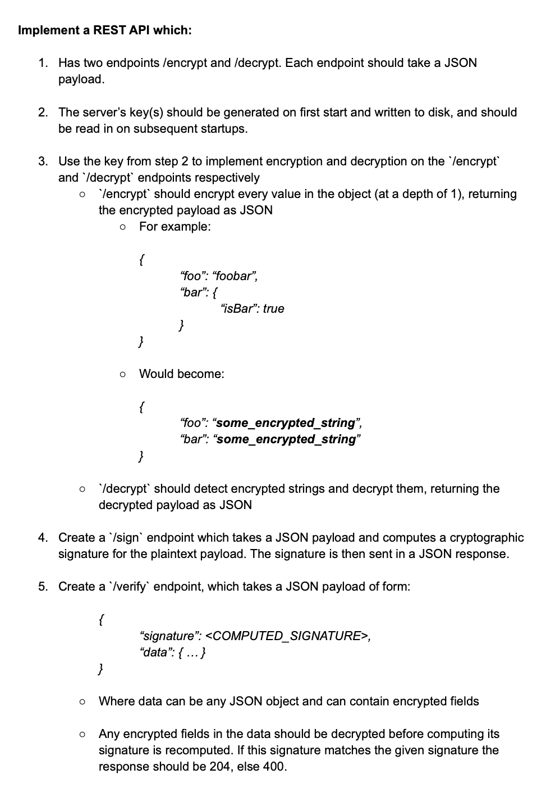
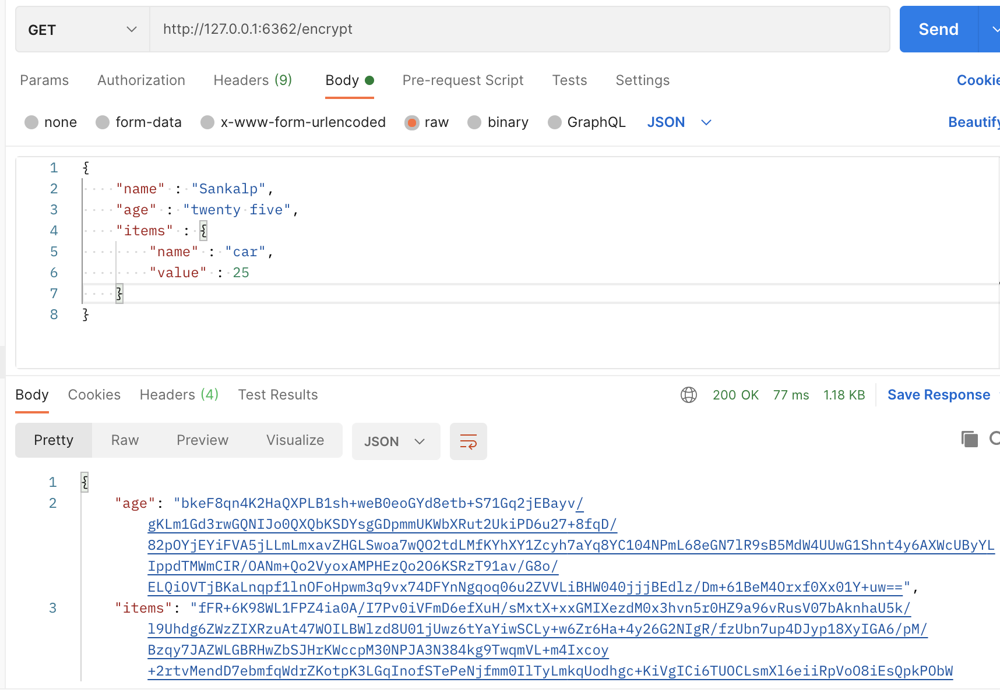
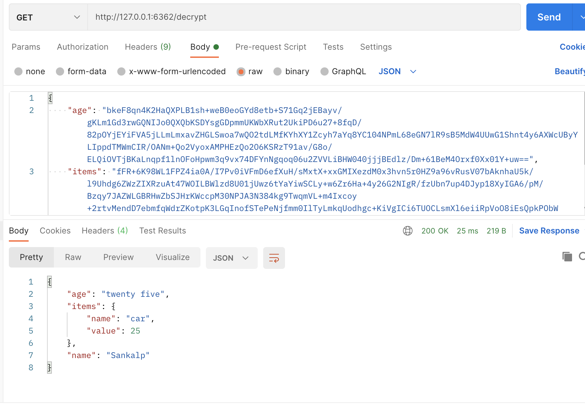
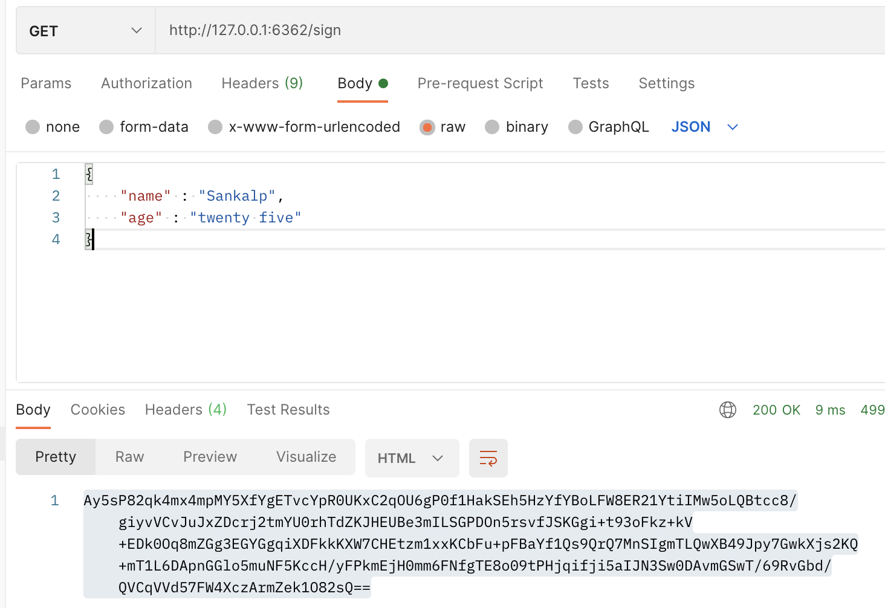
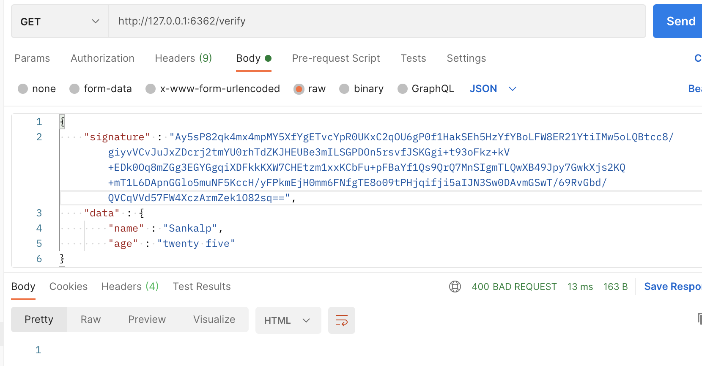

# REST_API_for_encryption

**evervault_rest_api.py** is the main file in this repository.

REST API, using Python/Flask, which handles 4 endpoints (see Task section below)
1. \encrypt 
2. \decrypt
3. \sign
4. \verfiy

This was my first time using
1. Flask to create working APIs
2. Crypto Libraries (SHA256, RSA etc)

## Requirements (How to run)

1. Create your python virtual environment using anaconda or something else you prefer (virtualenv)
2. Activate you environment
3. pip install flask
4. pip install pycryptodome
5. pip install shutil

This should be good to go

Now in terminal, run
> python evervault_rest_api.py

API should now be live at **127.0.0.1:6362**

(6362 is my car no, you can change it at the end of the python file to somthing easier)

Now you can test working of this API

## Task

## Result

You can check with POSTMAN software, all endpoints are working fine

1. /encrypt
 

2. /decrypt
 

3. /sign
Sign with SHA256 hashing and our private key 
 

4. /verify
If provided with correct signature, returns 204 response code

Or else 400 response code
 

## Small Note

Things are kept simple, and is not production ready, reasons -
1. Private keys are not handled at very best, so just to keep simple, they lie at *root_server_location/keys*
2. Security point of view, ther could be more vulnerabilities.
3. Data is expected to be in *JSON payload* and *HTTP Header = Content-Type : application/json* only.

## Little Learnings Along The Way

* Private and Public key, such as in RSA generation, are **inverse of each other**. That means if a message_text - A is encrypted with public key, then it can be decrypted with private key and vice verse, if A is encrypted with private key, it can be decrypted with public key.

* <ins>Assymetric Encryption</ins> - I will have a *public/private key pair*. I will share my *public key* with anyone who wants to send encrypted message to me. I will keep my *private key* safe and private. Anyone who sends me message can encrypt the message with public key I gave him, and only I can decrypt it using my private key.

* <ins>Symmetric Encryption</ins> - Only A and B in the whole world have access to the keys. So they can encrypt the message they send to each other, and only they can decrypt them.

* <ins>Signature</ins> - I can encrypt a message (after hashing it) with my *private keys*, and anyone can verify it (see verification below) using my public key.

* <ins>Verification</ins> - Anyone who has *public key* of A, can verify that a message can only be signed by someone who has access to A's private key.

* <ins> Certificate Authority (CA) </ins> - CA can sign the identity of some server, and a user, **who trusts that CA** (like our browser trusts Google CA) can verify that a signature is signed by that CA using the CA's public key.

* <ins> TLS/SSL </ins> - A user and server are trying to establish connection. Server will present its identity with signature of a CA. If user trusts CA, it can verify the signature using CA's public key, or else if it doesnt't trust or signature is not verified, either connection is aborted, or we will see untrusted CA in our browser (red warning - we see sometimes).
Once signature is verified, user will generate symmetric key, and share it with server by encrypting it with server's public key. Since this message can only be decrypted with server's private key, only user and server should be having access to the symmetirc key. For all future conversations, user and server will use that symmetric key for encryption/decryption.

